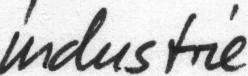
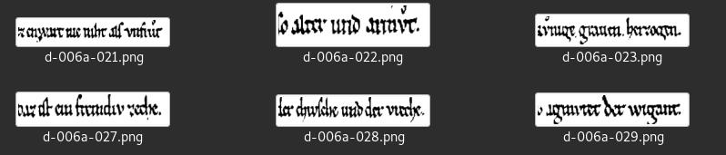

# datasets

Lists of datasets and dataset lists.

## Pictures of street scenes

* Type: labeled
* [Homepage](https://www.informatik.uni-augsburg.de/de/lehrstuehle/dbis/db/alumni/mandl/downloads/)
* [Data](https://www.informatik.uni-augsburg.de/de/lehrstuehle/dbis/db/alumni/mandl/downloads/webcam_streetscene.tgz) (tgz), 55M, 2515 files, b76908a2083093dd749489a27a0a8b8e2f3b3e8d4104a93f388ed6a96b70fdf8

Labels:

```
thr_nbg-street_0690+19-26-23.png dontknow
thr_nbg-street_0265+12-13-50.png yes
thr_nbg-street_0858+22-15-45.png no
thr_nbg-street_0727+20-3-42.png no
thr_nbg-street_0120+9-2-42.png yes
```

  

## IAM handwriting database

* [Homepage](http://www.fki.inf.unibe.ch/databases/iam-handwriting-database)

, 

## IAM online handwriting database

* [Homepage](http://www.fki.inf.unibe.ch/databases/iam-on-line-handwriting-database)

## IAM faces database

* [Homepage](http://www.fki.inf.unibe.ch/databases/iam-faces-database)

## IAM online document database

* [Homepage](http://www.fki.inf.unibe.ch/databases/iam-online-document-database)

> The IAMonDo-database (short for IAM online document database) contains 941
> online handwritten documents
acquired with a digital pen (Logitech IO2). The documents  consists of text
blocks, lists, tables, formulas, diagrams, drawings, and markings. Such pieces
of content have been placed in arbitrary positions on each document. Ground
truth information is provided down to the word level.  The digital ink, the
annotation, and the collected meta data of the writers are stored in xml-files
complying with the W3C standard InkML.  It can be used to train and test
methods for handwritten text recognition, document layout analysis, document
content identification, table recognition, marking detection, and lot more.

## IAM historical document database

> The IAM-HistDB is a repository of data sets that contain handwritten
> historical manuscript images together with ground truth data for training and
> testing automatic handwriting recognition systems.

* [Homepage](http://www.fki.inf.unibe.ch/databases/iam-historical-document-database)

* Saint Gall Database - 9th century, Latin
* Parzival Database - 13th century, German
* Washington Database - 18th century, English



## Technoset

> Technoset is a data-set of 90,933 electronic music loops, totalling around 50
> hours. Each loop has a length of 1.827-seconds and is at 128bpm. The loops
> are from 10,000 separate electronic music tracks.

* https://www.math.uci.edu/~isik/posts/Technoset.html

Formats: wav, hdf5.
